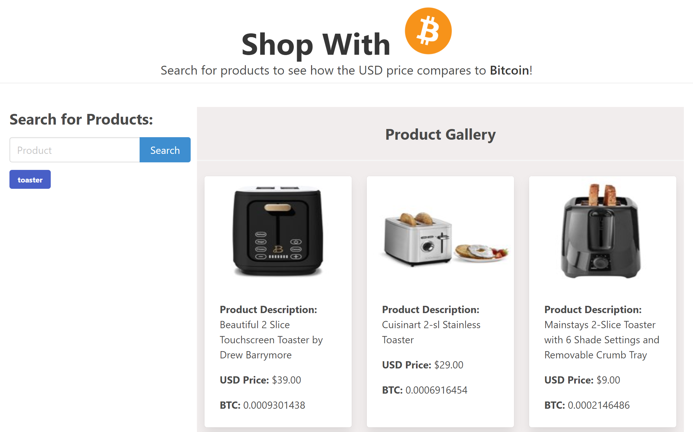
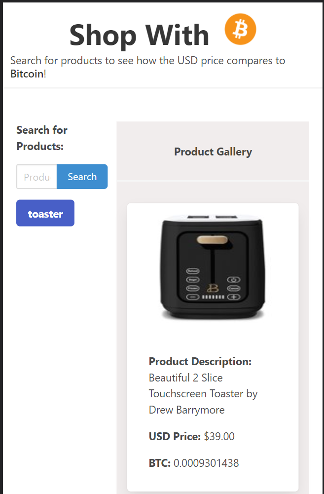

# Shop with Coin

## Interactive Front-End Project

# Description:

With the Crypto space heating up, people want to know what they can buy with their Bitcoin.  
Our website allows users to search for common products, and display their price in dollars and Bitcoin equivalent.  
Searches are persistent across sessions, so you can pick up where you left off.

## How To

Enter a product in the search bar, and click search to get products and prices.
You can look at previous searched terms by clicking the appropriate button below the search box.

## Technologies Used

- HTML
- Javascript
- JQuery
- Bulma CSS framework
- RapidAPI

# Mock-Up

### Screenshots

### Link to deployed site

https://gordonlc18.github.io/shopping_with_bitcoin/

## Contributors:

John Fulghieri, Latravia Gordon, Rebekkah Huss, Ernest Paul © 2022 All Rights Reserved.
